# ART BIBLE

Hi, I'm David, a student at the Polytechnic University of Catalonia. I have done a research on how to make an Art Bible during the realization of my second college career project.
## General Tips
### What's an Art Bible?

An Art Bible is a document created by the Art Director to communicate to the art team exactly what style the art assets should match. Its main objective is to establish a guide document that contains the details of what the game is going to look. This document is created after the Game Design Document (GDD) and before any art production. 

### Principal Objectives

The reason why this document is made has a serie of objectives that it tries to fulfill:
* Explain the idea of art that will appear in our videogame.
* Keep consistency in all the artistic elements of the game.
* Help the team get an idea of the game that is going to be done.
* Doubts are answered faster because we establish a series of guidelines.
* Help new members adapt faster to work.
* Help the marketing and communication sectors understand the game that is being done.
     
### Main points to take into account while doing an Art Bible
* Target audience we want to reach.
* This document should make clear the most important ideas to new members.
* It must be a document that clarifies all the doubts of the members of the group.
* Make clear the concept of the game that you want to create to our sponsors.

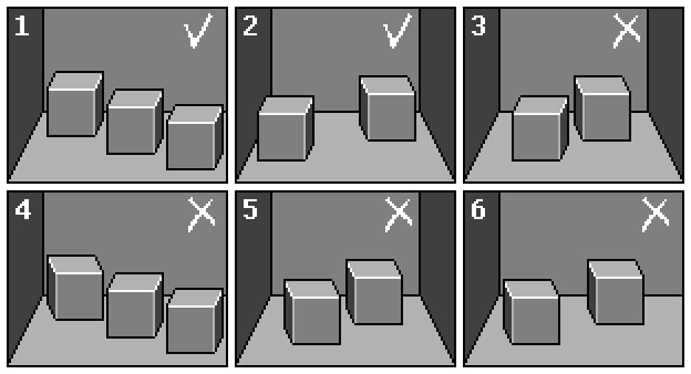
     
### Sources to help explain your Art Bible
* Concept Art.
* Photograpy.
* Simple Models.
* Diagrams.
* Completed Assets.
* Work from other media.
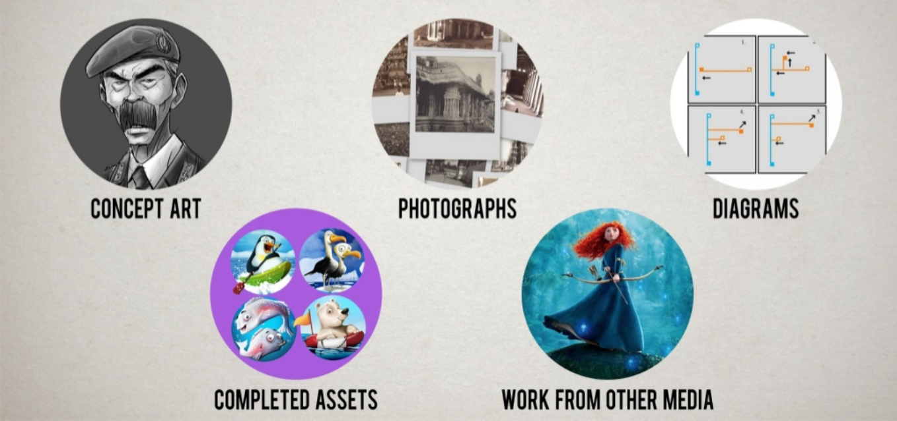

## During Art bible
### First steps to keep in mind

While creating the document, it is important to remember some tips:
* Adding a lot of text can complicate an explanation, it is much better to resort to visual content
* Agree the formats and tools that best suit the team
* Add small descriptions to the images and highlight important parts
* You can add priorities about the importance of a certain artistic element and/or a step-by-step list of how to make a certain element

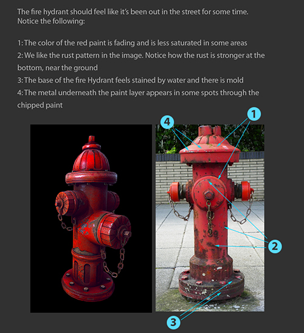
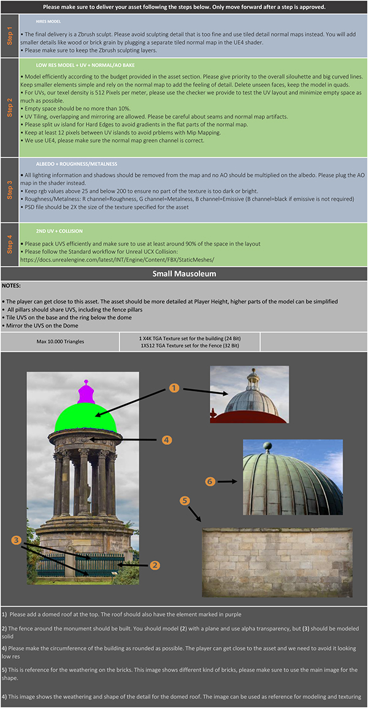

### In case of limited/no art background

If it is the case that our team does not stand out in the artistic field you can always follow these tips:
* Gather and include good reference examples.
* Prepare color palettes in the images that best suit your purpose.
* Explore several art reference websites, such as: [Pinterest](www.pinterest.com), [ArtStation](www.artstation.com), [Deviantart](https://www.deviantart.com/)...

## Content of an Art Bible
### References

Before starting to establish an art style, we should first look for references of elements similar to what we intend to achieve. The main sources to which to look for references would be:
* Ilustrations.
* Photographs.
* Comics.
* Videos and movies.
* Games.
* Ads.

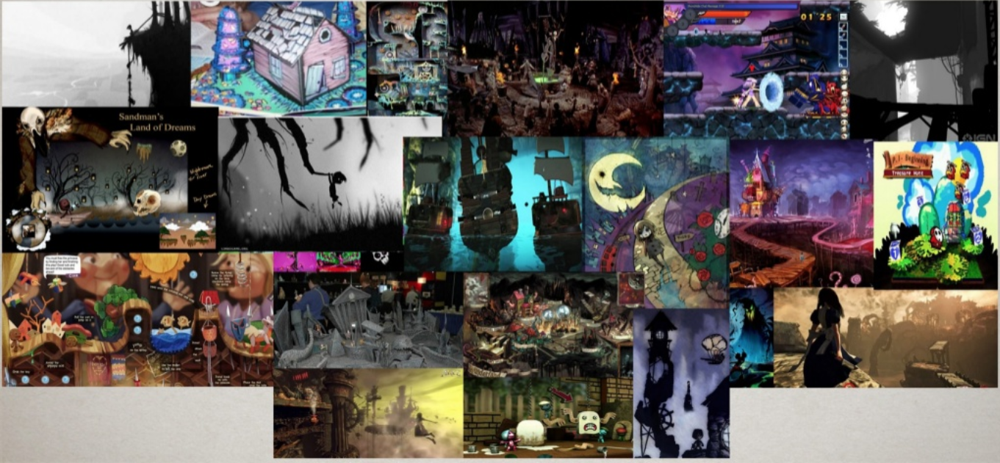

### Art style

Once we have obtained our references, we have to apply an identifiable set of characteristics that allow us to group a series of works or authors, which will share stable elements in terms of their form and contents. In these elements we must take into account:
* Environment Scale.
* Architectural Proportions.
* Characters Proportions.
* Technologies in use for hint of advancements.
* Methods of construction.
* Climate.
* Time period.
* Who lives in the environment.

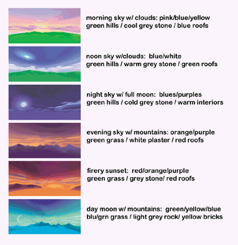
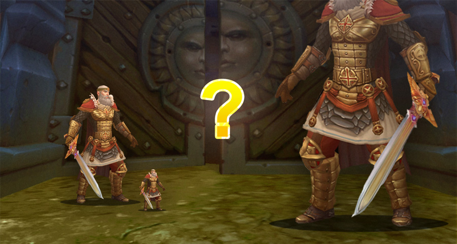

### L.O.D /Level of details

Depending on the artistic style chosen, you have to take into account the level of detail you want to reach. For example, a videogame centered on a cartoon style will not demand a level of detail equal to a realistic style videogame. The points taken into account in the level of detail are:
* The differences of detail in narrative, gameplay and UI. Sometimes different levels of detail are used for certain things in a videogame. An example would be when in League of Legends you choose a character that presents a high level of detail in the UI and then, in gameplay is a simpler model.
* How to achieve increase/decrease in details. Here we establish keys that would help a little detailed element transmit a lot of detail or how to extract details to an element that goes beyond the established detail.
* What and what not to detail. It is important to take into account the important characteristics of an element that must be detailed and those that are not so important.
* Character details. 
* Architectural details.

### Character Art

What elements stand out in our characters. Sometimes this process is done in parts:
* Expresions.
* Posing.
* Height Scale comparison.
* Color Palette.
* Costume/Drapery.
* Style and construction.
* Animations.

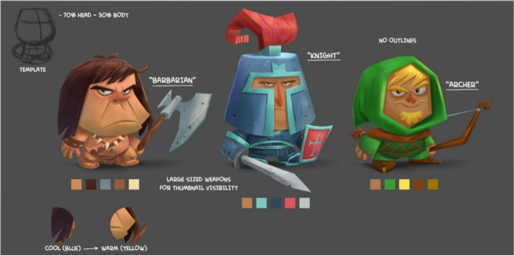

### Atmosphere/environment

As with our characters, we must choose how to organize the environment of the entire game:
* Scale.
* Openness.
* Weather Conditions.
* Props and other objects.
* Color palette.
* Style and construction.
* Animations.

### Color Palette

We designate a set of colors suitable for the decoration of a certain element so that it is in tune with the rest:
* Color Swatches.
* Vibrance and values.
* Environments with distinctly different palette choices.
* Saturation .
* Hues.

### Camera
* Narrative/story sequences.
* Field of view.
* Gameplay angle and character position
* Lights and shadows. That will modify all the art of the game.

### Texture & surface

* Ambient occlusion. Predominant color.
* Color Map. The majority of the painting will done in the color layers.
* Graphin patterns. To add some details/effects to the texture.

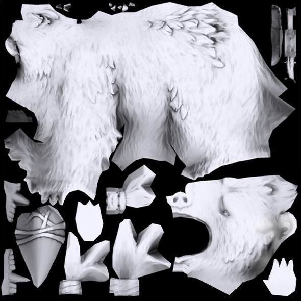
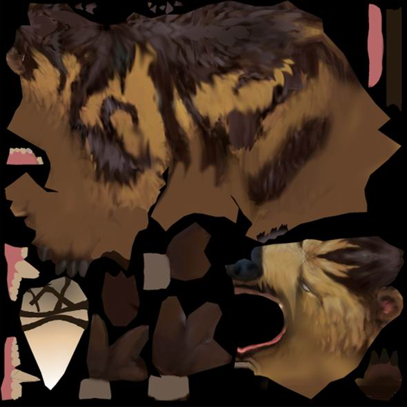
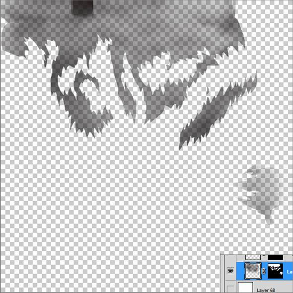

### User interface

* Font.
* Animations.
* Menu items and hud.

### Technical Guidelines

* Exporting. It is important to know in what formats we are going to save the files.
* Naming Conventions. Nomenclature.
* Resource Collection and structuring. What system will we use to structure the game files?
* Limitations. Set a limit of weight and content to the files.
* Tools to use.

## Bibliography
### Information
* [Art Videogame Rols](https://www.devuego.es/blog/2015/05/08/roles-en-la-creacion-de-videojuegos-iii-el-arte/)
* [Creating Art Bible](https://www.gamedev.net/forums/topic/552212-creating-art-biblestyle-guide/)
* [Videogame Color Theory](https://danielrparente.wordpress.com/tag/direccion-de-arte-en-videojuegos/)
* [Value of Communicating in Art](https://www.gamasutra.com/blogs/AndreaCordella/20160711/276701/The_Value_of_Communication_in_Art_Outsourcing_Best_Practices_to_Ensure_Quality.php)
* [Game Art Bible](https://es.slideshare.net/pencillati/game-art-bible-secret-sauce-to-making-great-game-art)
* [Color in Games](https://www.gamasutra.com/blogs/HermanTulleken/20150729/249761/Color_in_Games.php)
### Videogames Art Bible Examples
* [Pixel Cup](http://lpc.opengameart.org/static/lpc-style-guide/index.html)
* [Allods Online](http://shurick.livejournal.com/195876.html)
* [Dota2](https://support.steampowered.com/kb/8700-SJKN-4322/dota-2-character-texture-guide)
* [LeagueofLegends](https://na.leagueoflegends.com/en/news/game-updates/features/dev-blog-defining-rifts-visual-style)
* [Spyro](https://www.gamasutra.com/view/feature/131581/lessons_in_color_theory_for_spyro_.php)
* [Kingsbridge](https://www.gamasutra.com/blogs/SamuliSnellman/20130702/194913/The_Art_of_Kingsbridge_Bridging_casual_to_core.php)
* [Punch Clubs](https://www.gamasutra.com/blogs/AlexNichiporchik/20161205/286829/Punch_Clubs_guide_to_Pixel_Art.php)
* [The Trip](http://www.roguearbiter.com/port/theTrip/The%20Trip%20-%20Art%20Bible.pdf)
