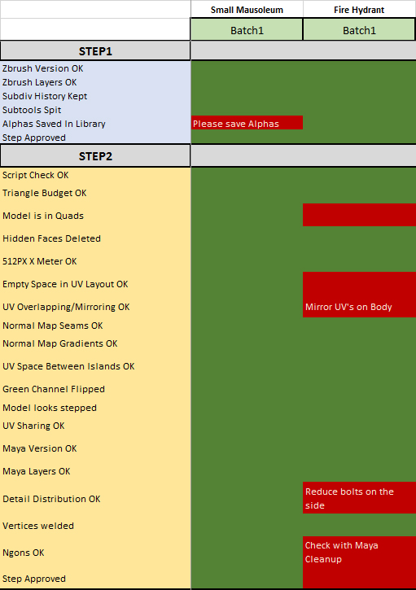
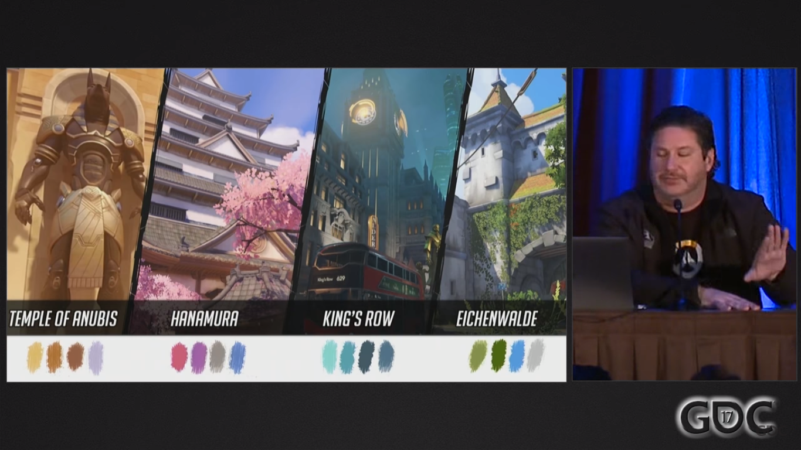
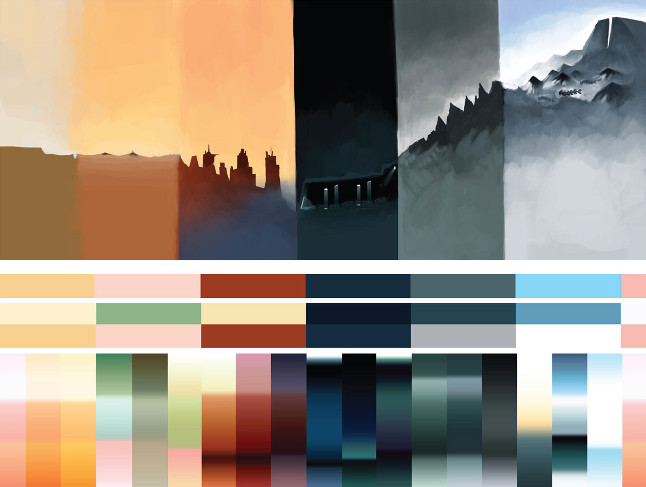
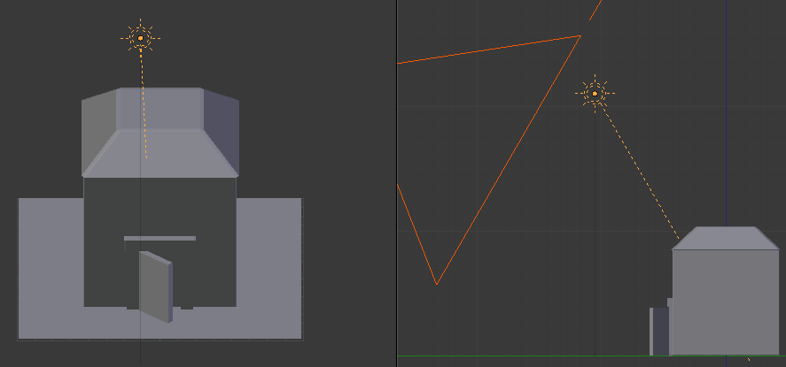
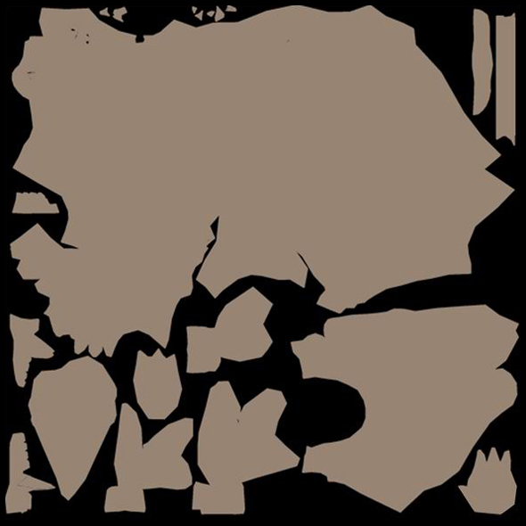

# ART BIBLE

Hi, I'm David, a student at the [Polytechnic University of Catalonia](https://www.citm.upc.edu/). I have done a research on how to make an Art Bible during the realization of my second college career project.

**_Before starting the description of this research, I would like to mention the web pages [Pixel Cup](http://lpc.opengameart.org/static/lpc-style-guide/index.html), [Game Art Bible](https://es.slideshare.net/pencillati/game-art-bible-secret-sauce-to-making-great-game-art) which contain very complete information on the subject and the [GDC](https://www.youtube.com/channel/UC0JB7TSe49lg56u6qH8y_MQ) conferences that have provided me with many examples of the current industry. I encourage you to visit their pages._**

## What's an Art Bible?

An Art Bible is a document created by the Art Director created after the Game Design Document (GDD) and before any art production. This document contains the idea of art that will appear in our videogame, keep consistency in all the artistic elements of the game, help the team get an idea of the game that is going to be done and establish a series of guidelines in order to answer any questions during the artistic process. 

### Principal Objectives

This guide helps **yourself** but also the reason why this document is made has a serie of objectives that it tries to fulfill:
* Serve as a guide for the entire **artistic team**. It must be a document that clarifies all the doubts of the members of the group. For this reason, this document could follow some of the guidelines as:
     * Use sources as concept **art, photography, simple models, diagrams, completed assets or work from other media**.
     * Add a lot of text can complicate an explanation, it is much better to resort to visual content.
     * Agree the formats and tools that best suit the team.
     * Add small descriptions to the images and highlight important parts.
     * Add priorities about the importance of a certain artistic element and/or a step-by-step list of how to make a certain element.
     * Add **COLOR!** Color is one of the most important factors for the viewing of a video game. We could talk a lot of things about color but I attach an article that perfectly explains all the things to take into account. [Color in games](https://www.gamasutra.com/blogs/HermanTulleken/20150729/249761/Color_in_Games.php)
     * Writing in the previous point about the color, there can be many sections of art, you can always establish a communication structure between sectors based on colors. For example, there are artists who are only responsible for drawing clothes in general, you can establish that the concept art made in red are those of the enemies and so when they have to draw their clothes they should know what their style should be.  
     

* Serve as a guide for the **new members**. This would help:
     * Doubts are answered faster because we establish a series of guidelines.
     * Adapt faster to work.
     

* It is useful to offer content later to our **target audience**:
     * Much of the material that comes out from the art bible later comes out in form of additional content.
* Help the **marketing and communication sectors** understand the game that is being done.
* Useful to catch **sponsors**.

## Content of an Art Bible

**_Here are some examples of Artibles that I have found_** [The Trip](http://www.roguearbiter.com/port/theTrip/The%20Trip%20-%20Art%20Bible.pdf) / [Liberated Pixel Cup](http://lpc.opengameart.org/static/lpc-style-guide/index.html)

Finding information about Art Bibles I concluded that to have a good Art Bible must be 5 basic sections:

### References

Before starting to establish an art style, we should first look for references of elements similar to what we intend to achieve. The main sources to which to look for references would be:
* Ilustrations.
* Photographs.
* Comics.
* Videos and movies.
* Games.
* Ads.

### Art style

Once we have obtained our references, we have to apply an identifiable set of characteristics that allow us to group a series of works or authors, which will share stable elements in terms of their form and contents. In these elements we must take into account:

**Character Art**. What elements stand out in our characters. In this section we take into account elements such as expresions, poses, physical construction, costumes, animations... 

**Atmosphere/environment**. As with our characters, we must choose how to organize the environment of the entire game. Props and other objects, architectural proportions, climate, time period, openness and animations are examples of important sections that need explanation.

**L.O.D /Level of details**. Depending on the artistic style chosen, you have to take into account the level of detail you want to reach. For example, a videogame centered on a cartoon style will not demand a level of detail equal to a realistic style videogame. The points taken into account in the level of detail are:
* How to achieve increase/decrease in details. Here we establish keys that would help a little detailed element transmit a lot of detail or how to extract details to an element that goes beyond the established detail.
* What and what not to detail. It is important to take into account the important characteristics of an element that must be detailed and those that are not so important.
* Character details. 
* Architectural details.

### Color Palette

We designate a set of colors suitable for the decoration of a certain element so that it is in tune with the rest:
* Color Swatches.
* Vibrance and values.
* Environments with distinctly different palette choices.
* Saturation .
* Hues.

**Camera**
* Narrative/story sequences.
* Field of view.
* Gameplay angle and character position
* Lights and shadows. That will modify all the art of the game.

**Texture & surface**

* Ambient occlusion. Predominant color.
* Color Map. The majority of the painting will done in the color layers.
* Graphin patterns. To add some details/effects to the texture.

### User interface
* The differences of detail in narrative, gameplay and UI. Sometimes different levels of detail are used for certain things in a videogame. An example would be when in League of Legends you choose a character that presents a high level of detail in the UI and then, in gameplay is a simpler model.
* Font.
* Animations.
* Menu items and hud.

### Technical Guidelines

* Exporting. It is important to know in what formats we are going to save the files.
* Naming Conventions. Nomenclature.
* Resource Collection and structuring. What system will we use to structure the game files?
* Limitations. Set a limit of weight and content to the files.
* Tools to use.

## Bibliography
### Information
* [Art Videogame Rols](https://www.devuego.es/blog/2015/05/08/roles-en-la-creacion-de-videojuegos-iii-el-arte/)
* [Creating Art Bible](https://www.gamedev.net/forums/topic/552212-creating-art-biblestyle-guide/)
* [Videogame Color Theory](https://danielrparente.wordpress.com/tag/direccion-de-arte-en-videojuegos/)
* [Value of Communicating in Art](https://www.gamasutra.com/blogs/AndreaCordella/20160711/276701/The_Value_of_Communication_in_Art_Outsourcing_Best_Practices_to_Ensure_Quality.php)
* [Game Art Bible](https://es.slideshare.net/pencillati/game-art-bible-secret-sauce-to-making-great-game-art)
* [Color in Games](https://www.gamasutra.com/blogs/HermanTulleken/20150729/249761/Color_in_Games.php)
### Videogames Art Bible Examples
* [Pixel Cup](http://lpc.opengameart.org/static/lpc-style-guide/index.html)
* [Allods Online](http://shurick.livejournal.com/195876.html)
* [Dota2](https://support.steampowered.com/kb/8700-SJKN-4322/dota-2-character-texture-guide)
* [LeagueofLegends](https://na.leagueoflegends.com/en/news/game-updates/features/dev-blog-defining-rifts-visual-style)
* [Spyro](https://www.gamasutra.com/view/feature/131581/lessons_in_color_theory_for_spyro_.php)
* [Kingsbridge](https://www.gamasutra.com/blogs/SamuliSnellman/20130702/194913/The_Art_of_Kingsbridge_Bridging_casual_to_core.php)
* [Punch Clubs](https://www.gamasutra.com/blogs/AlexNichiporchik/20161205/286829/Punch_Clubs_guide_to_Pixel_Art.php)
* [The Trip](http://www.roguearbiter.com/port/theTrip/The%20Trip%20-%20Art%20Bible.pdf)
* [Define and Evolving Overwatch Art](https://www.gamasutra.com/view/news/294063/Video_Defining_and_evolving_the_art_direction_of_Overwatch.php)
